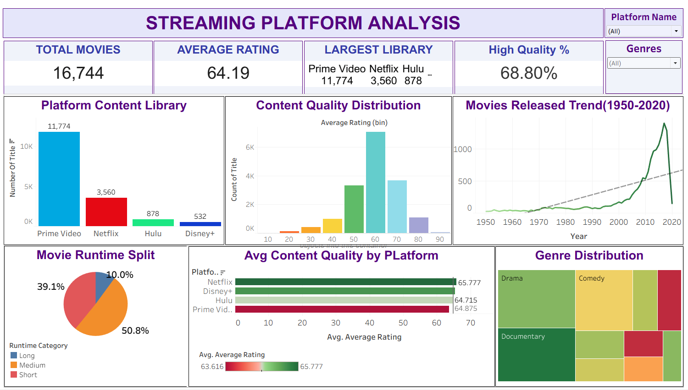

# 🎬 Movie Streaming Platform Analysis

## 📌 Project Overview
This project analyzes movies available across major streaming platforms such as Netflix, Hulu, Prime Video, and Disney+. 
The aim is to uncover insights related to content distribution, ratings, trends, and platform performance using Python, SQL, and Tableau.

---

## 🎯 Objectives
- Analyze distribution of movies across streaming platforms  
- Compare IMDb and Rotten Tomatoes ratings  
- Identify trends over years and decades  
- Explore genre popularity  
- Build an interactive Tableau dashboard  

---

## ⚙️ Tech Stack
- **Python** (Pandas, NumPy, Matplotlib, Seaborn)  
- **SQL** (Data querying and insights extraction)  
- **Tableau** (Dashboard & visualization)  

---

## 🔄 Project Workflow

### 1️⃣ Data Exploration
- Loaded dataset and explored structure  
- Identified missing values and data types  

### 2️⃣ Data Cleaning
- Handled missing values using median and defaults  
- Converted data types and cleaned columns  
- Created new features:
  - Average Rating  
  - Platform Count  
  - Decade  
  - Runtime Category  
  - Rating Category  

### 3️⃣ Exploratory Data Analysis (EDA)
- Platform-wise content distribution  
- Rating distributions (IMDb & Rotten Tomatoes)  
- Yearly movie release trends  
- Genre analysis  
- Correlation heatmap  

### 4️⃣ SQL Analysis
- Performed structured analysis using SQL queries  
- Extracted insights and stored results  

### 5️⃣ Dashboard Creation
- Designed an interactive Tableau dashboard  
- Visualized key insights for decision-making  

---

## 📁 Project Structure

Movie-Streaming-Analysis/
│
├── data/
│ ├── MoviesOnStreamingPlatforms.csv
│ ├── streaming_data_clean.csv
│
├── scripts/
│ ├── 01_data_exploration.py
│ ├── 02_data_cleaning.py
│ ├── 03_eda_analysis.py
│ ├── 04_sql_analysis.py
│
├── visualizations
│
├── sql_results
│
├── dashboard/
│ ├── tableaudashboard.twb
│ ├── dashboard_screenshot.png
│
├── project_summary.pdf
├── README.md
└── requirements.txt

---

## 📸 Dashboard Preview



---

## 📊 Key Insights
- Prime Video has the highest number of movies available  
- Strong correlation observed between IMDb and Rotten Tomatoes ratings  
- Most movies fall under the **medium runtime category**  
- Many movies are available on multiple platforms  
- Significant growth in movie releases over time  

---

## 🚀 How to Run the Project

### 1️⃣ Install Dependencies
```bash
pip install -r requirements.txt
python scripts/01_data_exploration.py
python scripts/02_data_cleaning.py
python scripts/03_eda_analysis.py
python scripts/04_sql_analysis.py

📂 Files Included

Python scripts for full data analysis pipeline

SQL analysis results

Tableau dashboard (.twb file)

Visualizations and charts

Final project report (PDF)

💡 Future Improvements

Build an interactive web dashboard using Streamlit

Implement a movie recommendation system

Automate data pipeline for real-time updates

👩‍💻 Author

Aashi Singh
